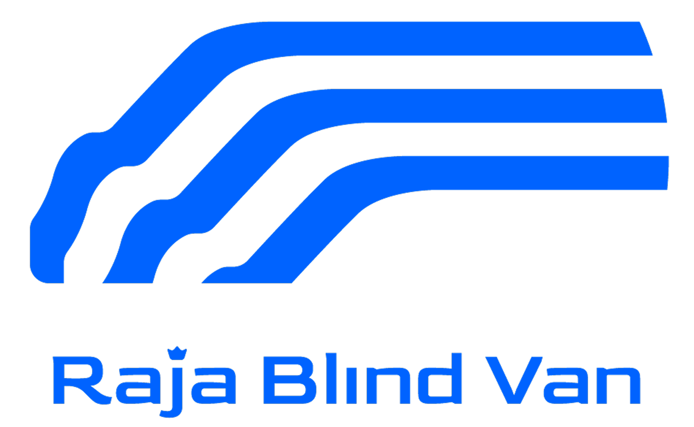

# 🚗 Rajablindvan Vehicle Dashboard

<p align="center">
  
</p>

<p align="center">
  <strong>Comprehensive Vehicle Management System for Blind Van Operations</strong>
</p>

<p align="center">
  <a href="#features">Features</a> •
  <a href="#installation">Installation</a> •
  <a href="#documentation">Documentation</a> •
  <a href="#screenshots">Screenshots</a> •
  <a href="#contributing">Contributing</a>
</p>

---

## 📋 About The Project

Rajablindvan Vehicle Dashboard adalah sistem manajemen kendaraan yang komprehensif, dirancang khusus untuk operasi blind van rental. Sistem ini membantu mengelola fleet kendaraan, customer, rental, maintenance, fuel consumption, dan expenses dengan efisien.

### Built With

-   **[Laravel 11.x](https://laravel.com)** - PHP Framework
-   **[Bootstrap 5](https://getbootstrap.com)** - CSS Framework
-   **[MySQL](https://www.mysql.com)** - Database
-   **[Chart.js](https://www.chartjs.org)** - Data Visualization
-   **[Font Awesome](https://fontawesome.com)** - Icons

---

## ✨ Features

### 🚙 Vehicle Management

-   Complete CRUD operations for vehicles
-   Track vehicle details (chassis, engine number, STNK, KIR)
-   Barcode system for fuel station integration
-   Document expiry date monitoring with alerts
-   Vehicle status tracking (Available, Rented, Maintenance)
-   Fuel consumption tracking and statistics

### 👥 Customer Management

-   Customer registration and profile management
-   Rental history tracking
-   Contact information and documentation

### 📦 Rental Management

-   Flexible rental types (Daily, Weekly, Monthly)
-   Real-time availability checking
-   Rental calculation and invoicing
-   Rental history and analytics

### 🔧 Maintenance Tracking

-   Schedule and track vehicle maintenance
-   Cost tracking per maintenance activity
-   Maintenance history and reports
-   Service reminder system

### ⛽ Fuel Management

-   Log fuel fills with barcode scanning
-   Track fuel consumption per vehicle
-   Calculate fuel efficiency (km/liter)
-   Fuel cost analysis

### 💰 Expense Management

-   Record all operational expenses
-   Categorize expenses by type
-   Monthly/yearly expense reports
-   Budget tracking and analysis

### 📊 Reports & Analytics

-   Comprehensive dashboard with statistics
-   Revenue and expense charts
-   Vehicle utilization reports
-   Fuel consumption analytics
-   Maintenance cost analysis

### 👤 User Management & Permissions

-   Three-tier role system:
    -   **Administrator**: Full access
    -   **Sales**: Rentals and customers
    -   **Operation**: Vehicles, maintenance, fuel
-   Role-based access control (RBAC)
-   User activity logging

### 📱 Responsive Design

-   Mobile-friendly interface
-   Touch-optimized for tablets
-   Collapsible sidebar for desktop
-   Hamburger menu for mobile
-   Adaptive layouts for all screen sizes

---

## 🚀 Installation

### Prerequisites

-   PHP >= 8.2
-   Composer
-   MySQL >= 8.0
-   Node.js & NPM (for frontend assets)

### Setup Steps

1. **Clone Repository**

    ```bash
    git clone https://github.com/akangumam/rajablindvan.git
    cd rajablindvan
    ```

2. **Install Dependencies**

    ```bash
    # Install PHP dependencies
    composer install

    # Install NPM dependencies
    npm install
    ```

3. **Environment Configuration**

    ```bash
    # Copy environment file
    cp .env.example .env

    # Generate application key
    php artisan key:generate
    ```

4. **Database Setup**

    ```env
    # Edit .env file with your database credentials
    DB_CONNECTION=mysql
    DB_HOST=127.0.0.1
    DB_PORT=3306
    DB_DATABASE=rajablindvan
    DB_USERNAME=root
    DB_PASSWORD=your_password
    ```

5. **Run Migrations & Seeders**

    ```bash
    # Create database tables
    php artisan migrate

    # Seed sample data (optional)
    php artisan db:seed
    ```

6. **Storage Link**

    ```bash
    # Create storage symlink for file uploads
    php artisan storage:link
    ```

7. **Build Assets**

    ```bash
    # Compile frontend assets
    npm run build

    # Or for development with hot reload
    npm run dev
    ```

8. **Install Git Hooks** (Optional but Recommended)

    ```powershell
    # Windows PowerShell
    .\setup-git-hooks.ps1
    ```

9. **Serve Application**

    ```bash
    # Start Laravel development server
    php artisan serve
    ```

10. **Access Application**
    ```
    Open browser: http://127.0.0.1:8000
    ```

### Default Login Credentials

After seeding:

-   **Email**: admin@rajablindvan.com
-   **Password**: password

---

## 📚 Documentation

Comprehensive documentation available in the project:

-   **[GIT_WORKFLOW.md](GIT_WORKFLOW.md)** - Git commands and best practices
-   **[GITHUB_SETUP.md](GITHUB_SETUP.md)** - GitHub configuration guide
-   **[.githooks/README.md](.githooks/README.md)** - Git hooks documentation
-   **[docs/RESPONSIVE_DESIGN.md](docs/RESPONSIVE_DESIGN.md)** - Responsive design guide
-   **[docs/USER_GUIDE.md](docs/USER_GUIDE.md)** - User manual
-   **[docs/PERMISSIONS.md](docs/PERMISSIONS.md)** - Role & permission system

---

## 📸 Screenshots

### Dashboard


### Vehicle Management


### Vehicle Detail with Barcode


### Rental Management


### Mobile Responsive


---

## 🛠️ Development

### Project Structure

```
rajablindvan/
├── app/
│   ├── Http/Controllers/    # Controllers
│   ├── Models/              # Eloquent Models
│   └── Providers/           # Service Providers
├── database/
│   ├── migrations/          # Database Migrations
│   └── seeders/             # Data Seeders
├── public/
│   ├── assets/              # Images, logos, icons
│   └── storage/             # Public storage (symlink)
├── resources/
│   ├── views/               # Blade Templates
│   ├── css/                 # Stylesheets
│   └── js/                  # JavaScript
├── routes/
│   └── web.php              # Web Routes
├── .githooks/               # Git Hooks
├── .github/                 # GitHub Actions & Templates
└── docs/                    # Documentation
```

### Running Tests

```bash
# Run all tests
php artisan test

# Run specific test
php artisan test --filter VehicleTest
```

### Code Quality

```bash
# PHP syntax check
find . -name "*.php" -exec php -l {} \;

# Laravel Pint (code formatting)
./vendor/bin/pint

# PHPStan (static analysis)
./vendor/bin/phpstan analyse
```

---

## 🤝 Contributing

Contributions are welcome! Please follow these steps:

1. Fork the repository
2. Create feature branch (`git checkout -b feature/AmazingFeature`)
3. Commit changes (`git commit -m 'feat: Add AmazingFeature'`)
4. Push to branch (`git push origin feature/AmazingFeature`)
5. Open Pull Request

Please read [CONTRIBUTING.md](CONTRIBUTING.md) for details on our code of conduct and contribution process.

### Commit Message Convention

Follow [Conventional Commits](https://www.conventionalcommits.org/):

-   `feat:` New feature
-   `fix:` Bug fix
-   `docs:` Documentation changes
-   `style:` Code style changes
-   `refactor:` Code refactoring
-   `test:` Adding tests
-   `chore:` Maintenance tasks

---

## 🗺️ Roadmap

-   [x] Vehicle Management CRUD
-   [x] Customer & Rental System
-   [x] Maintenance & Fuel Tracking
-   [x] Role-Based Permissions
-   [x] Responsive Design
-   [x] Barcode Integration
-   [ ] Email Notifications
-   [ ] PDF Report Generation
-   [ ] WhatsApp Integration
-   [ ] Mobile App (Flutter)
-   [ ] API for Third-party Integration
-   [ ] Multi-language Support

---

## 🐛 Known Issues

See [Issues](https://github.com/akangumam/rajablindvan/issues) for known bugs and feature requests.

---

## 📝 License

This project is licensed under the MIT License - see the [LICENSE](LICENSE) file for details.

---

## 👨‍💻 Author

**Akang Umam**

-   GitHub: [@akangumam](https://github.com/akangumam)
-   Email: your.email@example.com

---

## 🙏 Acknowledgments

-   Laravel Team for the amazing framework
-   Bootstrap Team for the UI components
-   Font Awesome for the icon library
-   All contributors and supporters

---

## 📞 Support

For support, email your.email@example.com or open an issue on GitHub.

---

<p align="center">Made with ❤️ for Rajablindvan</p>

<p align="center">
  <sub>Built with Laravel 11 • © 2025 Rajablindvan</sub>
</p>
